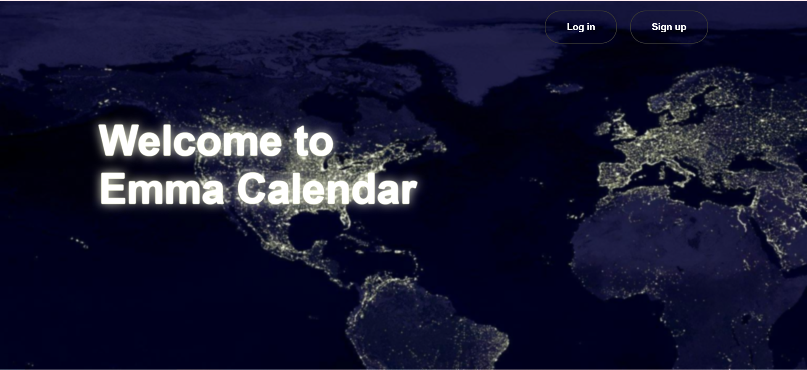
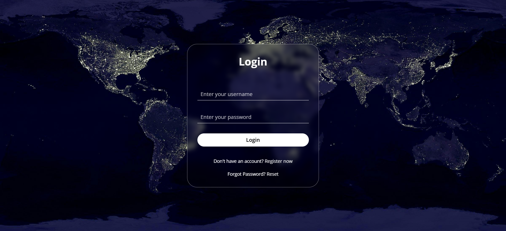
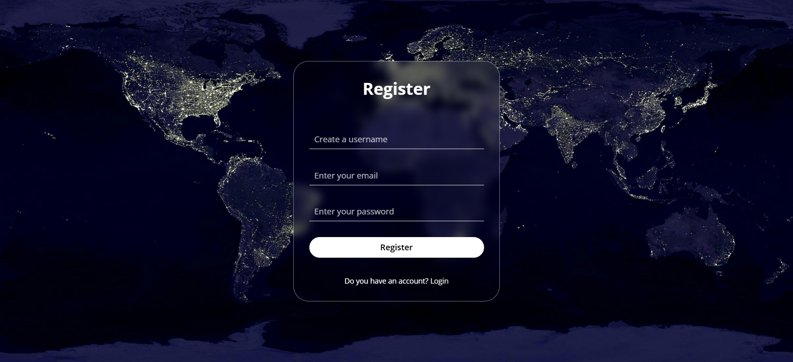
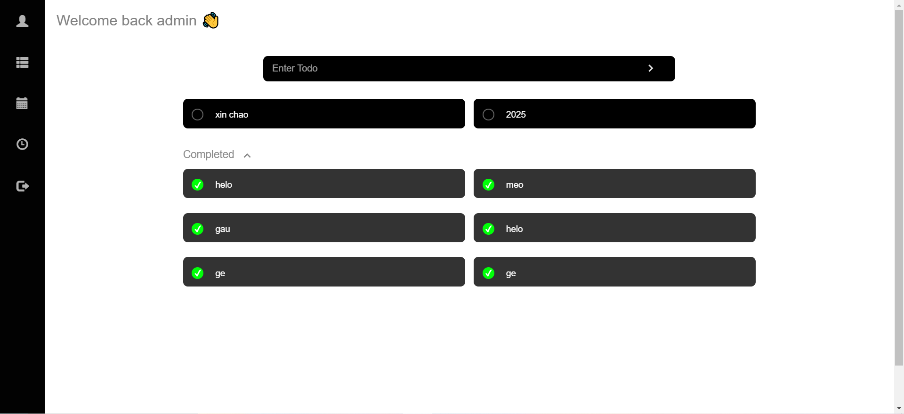
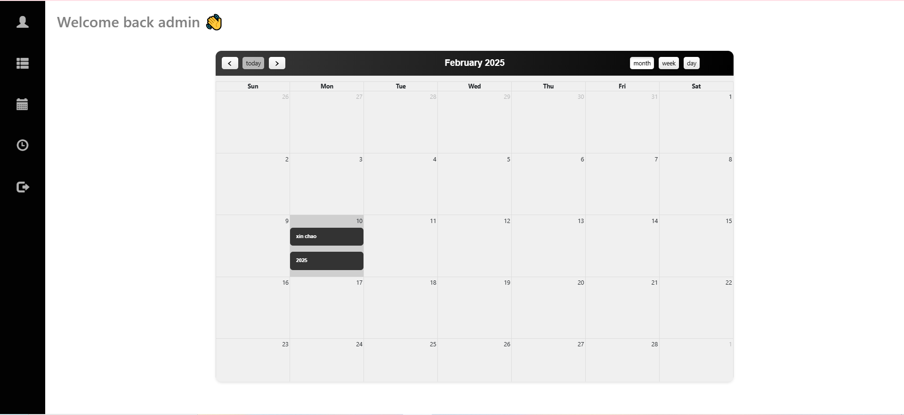
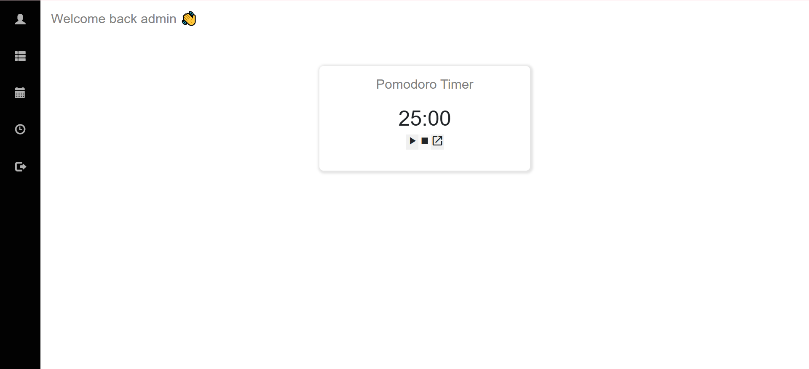

# Emma Calendar - Task Management with Calendar Integration

## The Challenge

Create a task management application with calendar integration using Django.

## Screenshot

## Links

- Solution URL: https://github.com/emcasa214/EmmaCalendar.git

## My Process

### Built with

- Django 3.2.12
- Python 3.10.12
- HTML5
- CSS3
- JavaScript
- FullCalendar library

### What I Learned

Through this project, I learned:
- How to create a Django application for task management
- Integrating date selection for tasks
- Implementing a calendar view using FullCalendar
- Handling form submissions and database operations in Django

### Continued Development

I plan to continue improving the application by:
- Enhancing the user interface
- Adding more features like task categorization and recurring tasks
- Implementing user authentication and personal task lists

## Author

- Em Casa
- [GitHub Profile](https://github.com/emcasa214)
